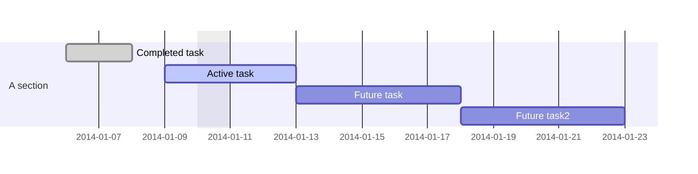

## Footnotes

Here's a simple footnote [^1]

[^1]: meaningful!

## Note

> [!NOTE]
> This is how notes are work!

> Blockquote

## Table

First Header | Second Header
------------ | ------------
Content from cell 1 | Content from cell 2
Content in the first column | Content in the second column

## TaskList

- [x] #tags, [links](), **formatting** supported
- [x] list syntax required (any unordered or ordered list supported)
- [x] this is a complete ite
- [?] this is also a complete item (works with every character)
- [ ] this is an ==incomplete== item
- [ ] tasks can be clicked in Preview to be checked off

## Diagramm



## Math

$$\begin{vmatrix}a & b\\
c & d
\end{vmatrix}=ad-bc$$

## Code

### SQL

```sql
ALTER TABLE VEHICLEMOVEMENT DROP COLUMN GROSSWEIGHT;  
ALTER TABLE vehiclemovement ADD grossweight GENERATED ALWAYS AS (ZedasAdmin.calcGrossWeight(tareweight,grossweightcargo));
```

### Java

```java
public static void main(String[] arg) {
	// lets go
}
```